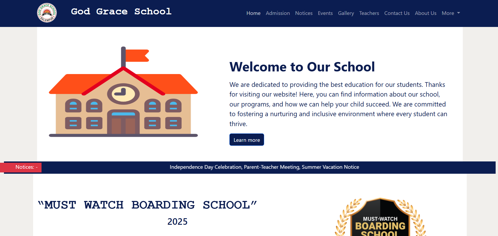
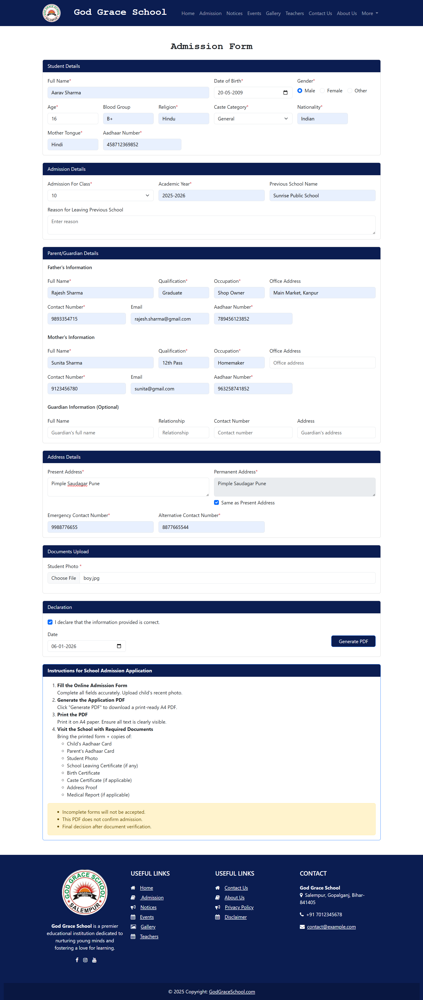
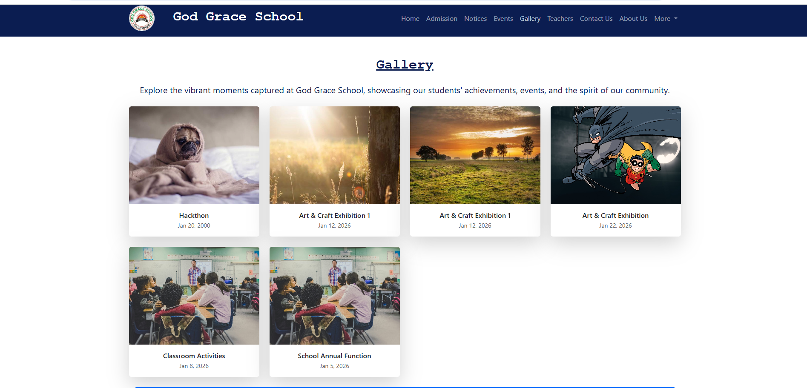
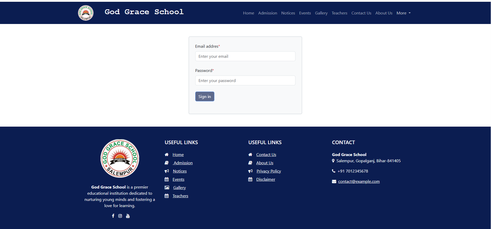
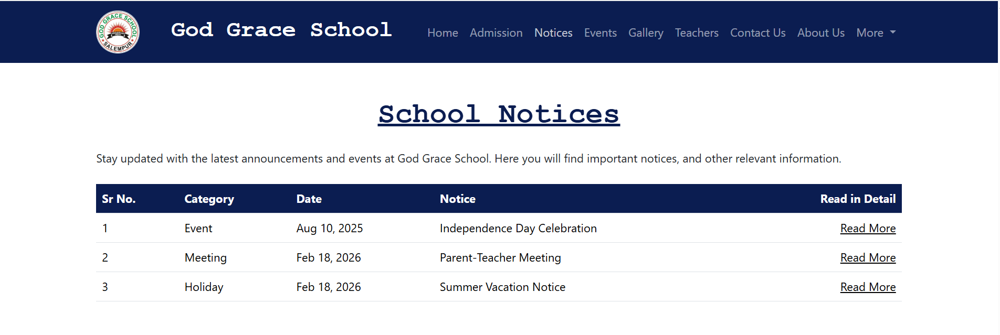
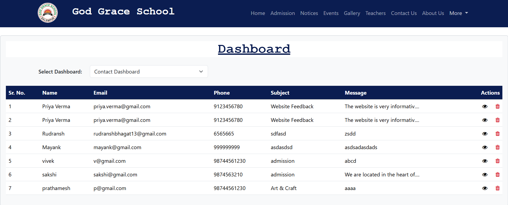
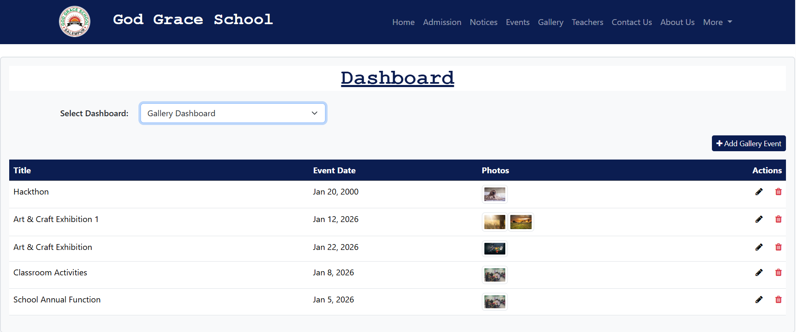
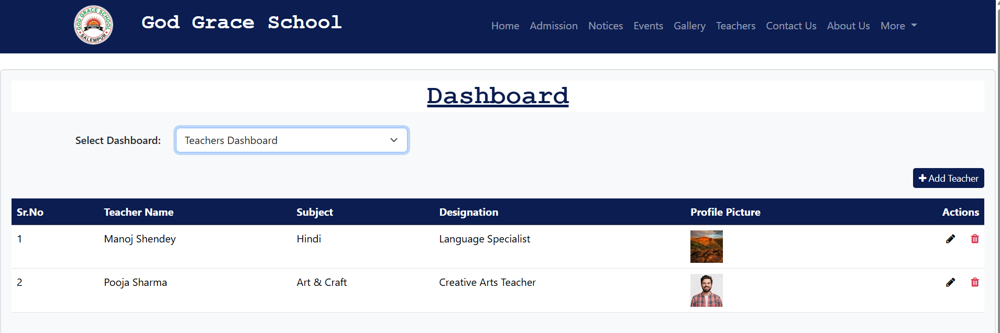
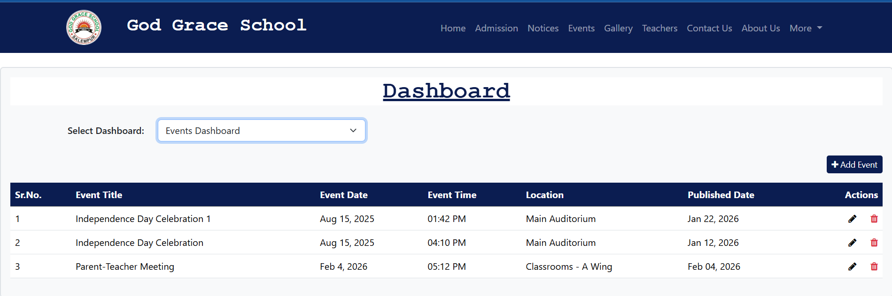

# MEAN Stack Full-Stack Project


This is a full-stack web application built using the MEAN stack.


## Tech Stack

- MongoDB
- Express.js
- Angular
- Node.js


## Project Structure

mean-stack-project/
├── frontend/ # Angular frontend
├── backend/ # Node + Express backend
├── data/ # JSON / sample data
└── README.md


## Frontend Setup

```bash
cd frontend
npm install
ng start

The frontend will run on:
http://localhost:4200


---

## Add Backend Setup Instructions

Paste:

```md
## Backend Setup

```bash
cd backend
npm install
node server.js

## Project Screenshots

### Home Page


### Admission Form


### Teachers


### Gallery


### Login


### Notice Board


###  Dashboard






